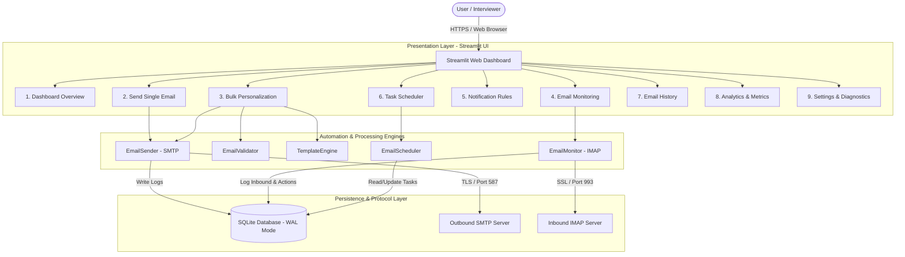

# ⚡ Email Automation & Notification System

> **Automate • Personalize • Monitor • Schedule**
>
> A production-ready, enterprise-grade Email Automation, Personalization, and Inbound Intelligence Web Application built with **Python 3.12+**, **Streamlit**, **SMTP**, **IMAP**, and **SQLite (WAL mode)**. Deployable on Render with full cloud compliance.

[](https://python.org)
[](https://streamlit.io)
[](https://sqlite.org)
[](https://render.com)
[](LICENSE)

---

## 🔗 Live Demo & Repository
- **Live Application:** [https://email-automation-system.onrender.com](https://email-automation-system.onrender.com) *(Update with your deployed Render URL)*
- **GitHub Repository:** [https://github.com/sadhna1118/email-automation-system](https://github.com/sadhna1118/email-automation-system)

---

## 📌 Project Overview
The **Email Automation & Notification System** transforms routine communication into a reliable, intelligent operational pipeline. Built to resolve the bottlenecks of manual outreach and unmonitored inboxes, it combines:
1. **Outbound Personalization:** Dynamic templating engine replacing `{name}`, `{company}`, and custom variables from uploaded CSVs.
2. **Rate Limiting & Provider Safety:** Throttled batch dispatch respecting Google/Outlook SMTP thresholds.
3. **Inbound Inbox Intelligence:** IMAP-based listener parsing unseen messages and applying rule triggers.
4. **Automated Notification Rules:** Real-time email alerts and auto-replies based on sender, subject, and body keywords.
5. **Persistent Background Scheduling:** Automated single dispatches, daily bulk campaigns, and weekly digests.
6. **Audit & Analytics:** 100% SQLite-backed delivery metrics, tracking logs, and CSV exports.

---

## 📸 Dashboard Screenshots
```
+-----------------------------------------------------------------------------------+
| ⚡ Email Automation & Notification System                                         |
| Automate • Personalize • Monitor • Schedule                                       |
+-----------------------------------------------------------------------------------+
| [Total Sent: 1,240]    [Delivered: 99.2%]    [Monitored: 418]    [Rules: 5 Active]|
+-----------------------------------------------------------------------------------+
|  [ Recent Activity Log ]   | Recipient         | Status   | Sent At   | Opened    |
|                            | alex@acme.com     | SUCCESS  | 09:15 AM  | ✓ Yes     |
|                            | sarah@tech.co     | SUCCESS  | 09:14 AM  | ✓ Yes     |
+-----------------------------------------------------------------------------------+
```
*(Upload your live screenshot to `assets/dashboard.png` after Render deployment)*

---

## 🏗️ System Architecture



---

## 🛠️ Tech Stack
| Component | Technology | Description |
| :--- | :--- | :--- |
| **Language** | Python 3.12+ | Core runtime environment |
| **Web Framework** | Streamlit | Responsive SaaS-style web interface |
| **Outbound Protocol** | Python `smtplib` + `email.mime` | Authenticated SMTP over STARTTLS / SSL with connection pooling |
| **Inbound Protocol** | Python `imaplib` | RFC 822 / RFC 2047 multi-part header parsing and unseen mail fetch |
| **Database** | SQLite3 (WAL Mode) | Zero-maintenance ACID relational store with Write-Ahead Logging |
| **Data Processing** | Pandas | CSV normalization, filtering, and history exports |
| **Visual Charts** | Altair | Interactive volume histograms and delivery breakdown charts |
| **Task Scheduler** | Python `schedule` + `threading` | Background daemon executing persistent scheduled jobs |
| **Configuration** | `python-dotenv` | Secure 12-factor environment variable loading |
| **Testing** | `pytest` | 20 unit and mock integration tests |
| **Deployment** | Render Cloud | Automated Git-driven web service container |

---

## ✨ Features Breakdown

### 1. Dashboard Overview
- High-level KPIs: Total Emails Sent, Successful Emails, Failed Emails, Monitored Emails, Active Rules, Scheduled Tasks.
- Live recent activity feed with status badges (`SUCCESS`, `FAILED`, `PENDING`).
- One-click navigation shortcuts to major workflow centers.

### 2. Single Email Dispatch
- Clean composer with RFC syntax validation and disposable domain warnings.
- Plain text or responsive Rich HTML formatting.
- Connection pooling with automatic retry handling.

### 3. Bulk Email Personalization
- Dynamic CSV parser accepting standard headers (`email`, `name`, `company`, etc.).
- Tag detection chips showing all available variables (e.g. `{name}`, `{company}`).
- Multi-tab live preview showing the exact rendered output for sample recipients.
- Adjustable rate-limiting slider (0.1s to 5.0s) to prevent spam flagging.
- Real-time progress bar (0% -> 100%) with completion metrics.

### 4. IMAP Email Monitoring
- Real-time inbound mailbox listener with background daemon thread.
- Multi-action rule processing on unread messages.
- **Interactive Simulator:** Simulate incoming messages directly in the UI to demonstrate rule triggering without waiting for external emails.

### 5. Smart Notification Rules
- Configurable rules filtering by Sender, Subject Keyword, and Body Phrases.
- Condition match logic: `AND` / `OR`.
- Custom destination alert address per rule with fallback to system defaults.
- Toggle Enable/Disable, trigger counter, and deletion controls.

### 6. Background Task Scheduler
- Schedule single dispatches, bulk campaigns, recurring inbox polling, or weekly digest reports.
- Daily, Weekly, or custom interval timers.
- SQLite-backed state synchronization with Enable, Disable, and Delete actions.

### 7. Sent Email History & Audit Log
- Searchable log of every email dispatch.
- Filters by Status (`All`, `SUCCESS`, `FAILED`), Recipient search, and Date Range.
- One-click **Export to CSV** for audit compliance.

### 8. Analytics & Metrics
- All metrics computed strictly from SQLite (no fake numbers).
- Daily volume trend charts (Successful vs. Failed bar charts).
- Delivery ratio donut charts and deliverability health benchmarks.

### 9. Settings & Diagnostics
- Safe configuration viewer displaying `Configured ✓` for secrets without exposing passwords.
- Interactive **SMTP Connection Test** and **IMAP Connection Test** buttons.
- Safe Dry-Run Simulation toggle.

---

## 🚀 Local Installation & Setup

### Prerequisites
- Python 3.12+ installed
- Git installed
- Optional: Gmail account with a 16-character [Google App Password](https://myaccount.google.com/apppasswords)

### Step 1: Clone the Repository
```bash
git clone https://github.com/sadhna1118/email-automation-system.git
cd email-automation-system
```

### Step 2: Create and Activate Virtual Environment
```bash
# Windows
python -m venv .venv
.venv\Scripts\activate

# macOS / Linux
python3 -m venv .venv
source .venv/bin/activate
```

### Step 3: Install Dependencies
```bash
pip install -r requirements.txt
```

### Step 4: Configure Environment Variables
Copy the `.env.example` template:
```bash
# Windows
copy .env.example .env

# macOS / Linux
cp .env.example .env
```
Edit `.env` with your preferred settings:
```env
SMTP_SERVER=smtp.gmail.com
SMTP_PORT=587
IMAP_SERVER=imap.gmail.com
IMAP_PORT=993
EMAIL_ADDRESS=your_email@gmail.com
EMAIL_PASSWORD=your_16_char_app_password
NOTIFICATION_EMAIL=alerts@yourdomain.com
DRY_RUN=true
DB_PATH=emails.db
```

> **Note on Simulation Mode:** `DRY_RUN=true` allows full interactive testing of all features without sending actual network emails or needing live Gmail credentials. Set `DRY_RUN=false` when ready to send live emails.

### Step 5: (Optional) Seed Demo Dataset
Populate sample contacts, templates, and rules:
```bash
python seed_demo_data.py
```

### Step 6: Launch the Web Dashboard
```bash
streamlit run app.py
```
Open **[http://localhost:8501](http://localhost:8501)** in your web browser.

---

## 🧪 Automated Testing
Run the comprehensive test suite with `pytest`:
```bash
pytest tests/test_automation.py -v
```
All 20 test cases will execute using in-memory / temporary test databases and network mocks (zero real emails dispatched during testing).

---

## ☁️ Deployment on Render

This repository includes a pre-configured `render.yaml` blueprint.

### Deployment Steps:
1. Push your repository to GitHub:
   ```bash
   git add .
   git commit -m "feat: complete professional streamlit email automation system"
   git push origin main
   ```
2. Log in to [Render](https://render.com).
3. Click **New +** → **Blueprint** (or **Web Service**).
4. Connect your GitHub repository: `sadhna1118/email-automation-system`.
5. Select **Python** runtime:
   - **Build Command:** `pip install -r requirements.txt`
   - **Start Command:** `streamlit run app.py --server.port $PORT --server.address 0.0.0.0`
6. Under **Environment Variables**, set:
   - `PYTHON_VERSION`: `3.12.4`
   - `DRY_RUN`: `true` (or `false` for live dispatch)
   - `SMTP_SERVER`: `smtp.gmail.com`
   - `SMTP_PORT`: `587`
   - `IMAP_SERVER`: `imap.gmail.com`
   - `IMAP_PORT`: `993`
   - `EMAIL_ADDRESS`: `your_email@gmail.com`
   - `EMAIL_PASSWORD`: `your_app_password`
   - `NOTIFICATION_EMAIL`: `your_alert_recipient@gmail.com`
   - `DB_PATH`: `emails.db`
7. Click **Deploy**. Your live dashboard will be accessible at:
   `https://email-automation-system.onrender.com`

---

## ☁️ Important Cloud Deployment Consideration
In cloud platforms like Render:
- **Web Service:** Runs the Streamlit dashboard. On the free tier, free web services sleep after 15 minutes of inactivity.
- **Worker Service (Recommended for 24/7 Monitoring):** For continuous background IMAP monitoring and cron scheduling that never sleeps, Render allows running a background Worker with `python main.py --monitor`.
- Environment variables securely inject credentials without committing secrets.

---

## 🛡️ Security & Deliverability Best Practices
- **No Hardcoded Secrets:** Credentials are read exclusively from environment variables.
- **`.gitignore` Enforced:** `.env` and SQLite journal files are ignored from source control.
- **Masked Credentials:** UI diagnostics display `Configured ✓` rather than exposing passwords.
- **RFC 5322 Syntax Check:** Addresses are pre-validated before reaching network sockets.
- **Configurable Rate Limiting:** Delays between bulk transmissions prevent IP reputation penalties.
- **Disposable Domain Flagging:** Detects temporary inboxes before queuing.

---

## ⚠️ Limitations & Future Roadmap
- **Current Limitations:**
  - Free Render instances put inactive web apps to sleep after 15 minutes.
  - SQLite is single-node; for multi-instance horizontal scaling, PostgreSQL can be integrated.
- **Future Enhancements:**
  - OAuth2 authentication for Google Workspace & Microsoft 365 (replacing App Passwords).
  - Open & click webhooks for real-time tracking callbacks.
  - Multi-tenant user login and role-based permissions (RBAC).
  - AI-assisted subject line generation and sentiment analysis.

---

## 📄 License
This project is licensed under the MIT License — see the [LICENSE](LICENSE) file for details.
